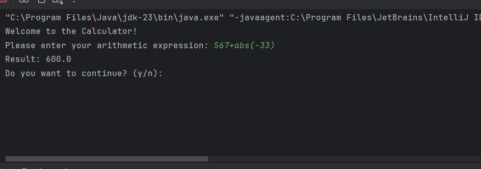
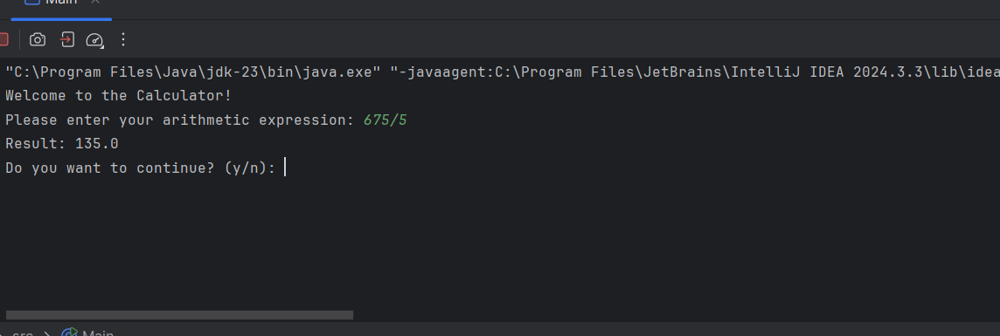
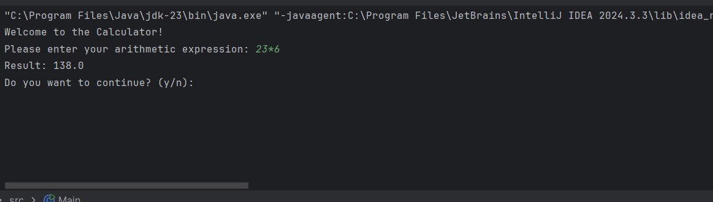
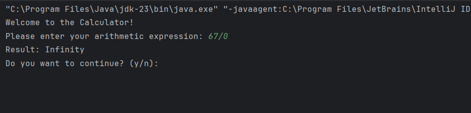
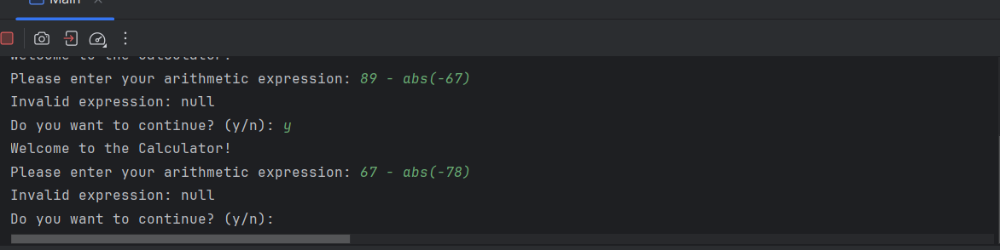

# Project Documentation : Calculator
Description

This program is a simple console-based calculator that supports basic arithmetic operations like addition, subtraction, multiplication, division, modulus, and exponentiation. Additionally, it supports functions like square root (sqrt), absolute value (abs), and rounding (round). The program evaluates user-inputted arithmetic expressions and outputs the results.

Supported Operations:

~Arithmetic: *Addition (+), Subtraction (-), Multiplication (*), Division (/), Modulus (%), Exponentiation (^).*

~Functions: *sqrt, abs, round.*

Workflow:

1.The user inputs an arithmetic expression.

2.The program parses the expression and performs the necessary calculations.

3.The result is displayed on the screen.

4.The user can continue entering expressions or exit the program.

Code Structure and Logic:

1.Expression Parsing: The program uses a recursive descent parser to evaluate the expression. It breaks down the expression into smaller components (terms, factors, numbers, and functions).

2.Handling Functions: Functions like sqrt, abs, and round are processed by reading the function name, parsing the argument, and then applying the corresponding mathematical operation.

3.Error Handling: If the expression is malformed or an unexpected character is encountered, an exception is thrown with a descriptive error message.

4.Arithmetic Operations: Standard arithmetic operations are processed using standard rules of precedence (multiplication and division before addition and subtraction).

Notes:

~The program currently handles basic arithmetic operations, functions, and parentheses.

~If the user enters an invalid expression, the program will throw an exception and output an error message.

~The program could be extended in the future to support more mathematical functions like trigonometric operations, logarithms, etc.

## Example outputs
1.
2.
3.

### My Challenges and How I decide it.

1. My first problem:

When you divide to zero, you get in result:infinity. But, of course, according to Java this answer is correct, but i should make a calculator.

Decision: So, i just add condition before a dividing, which will throw an error and not perform the calculation if the divisor is zero.

2. My second problem:

When you use some functions like *abs()* or *sqrt()*, in result show: null.

Decision:This issue was resolved by explicitly handling string-based functions like abs and sqrt. The program now correctly identifies and evaluates these functions by using a while loop to check for function names (alphabetical characters) and applying the corresponding function.

